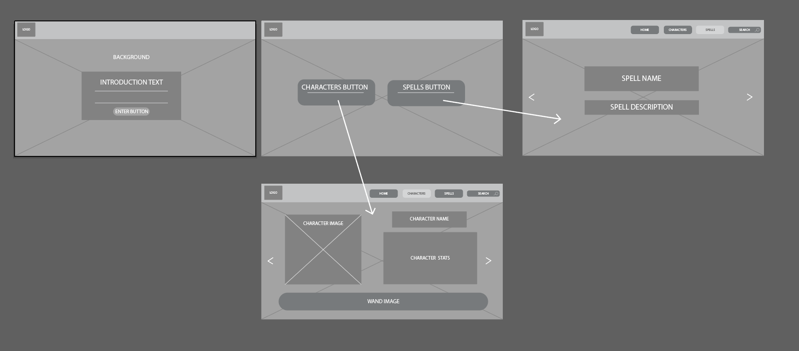
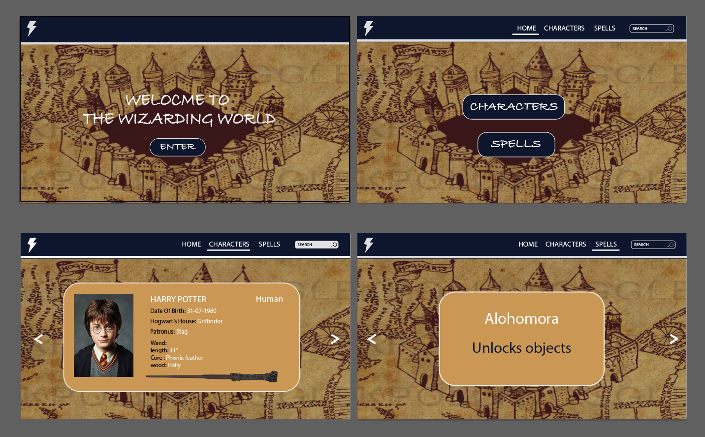
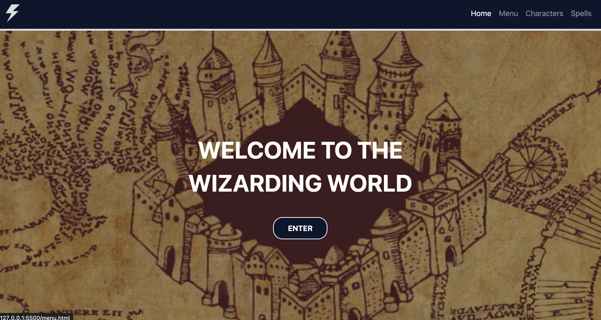
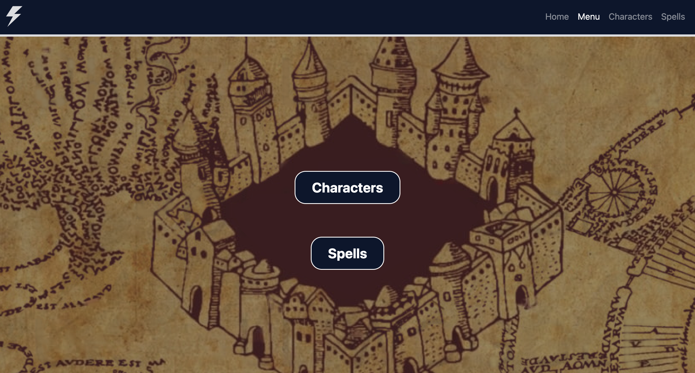
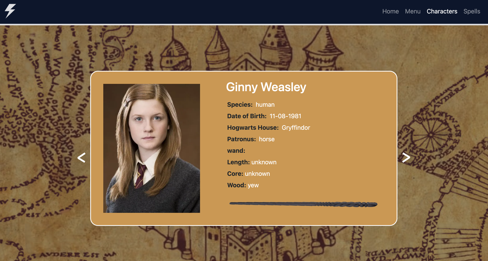
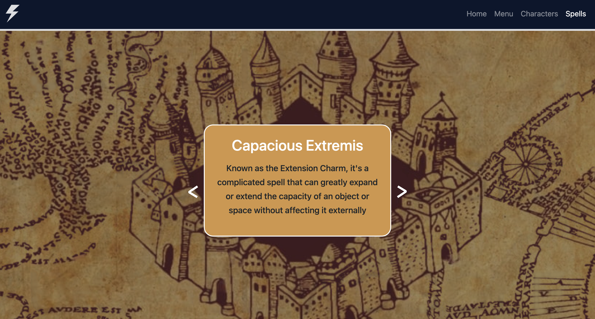

# wizarding-world

This repo contains all the files for my personal wizarding world website that i'm designing.

# introduction

The idea for this project was to create a Harry Potter themed website that introduces users to the Wizarding world and its characters and also to spells and magic used within the book series.

My sisters and I have grown up watching the films, reading the books and quizzing each other on our knowledge of the Harry Potter universe so I wanted to create something that we could use together.

## Table of Contents

- [Installation](#installation)
- [Technologies](#technologie)
- [Screenshots](#screenshots)
- [License](#license)

## Installation

No need to install anything to view this project; you can view it [here](https://chriskeno95.github.io/wizarding-world/index.html)

## Technologies

To create this project i have used Bootstrap, Javasript, JQuery, HarryPotterAPI and i also used ChatGPT to help write time consuming code that had to be repeated for characters.

## Screenshots

## License

MIT licence

---

© 2022 edX Boot Camps LLC. Confidential and Proprietary. All Rights Reserved.
